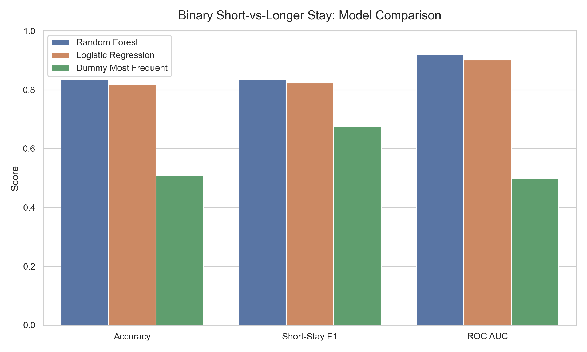
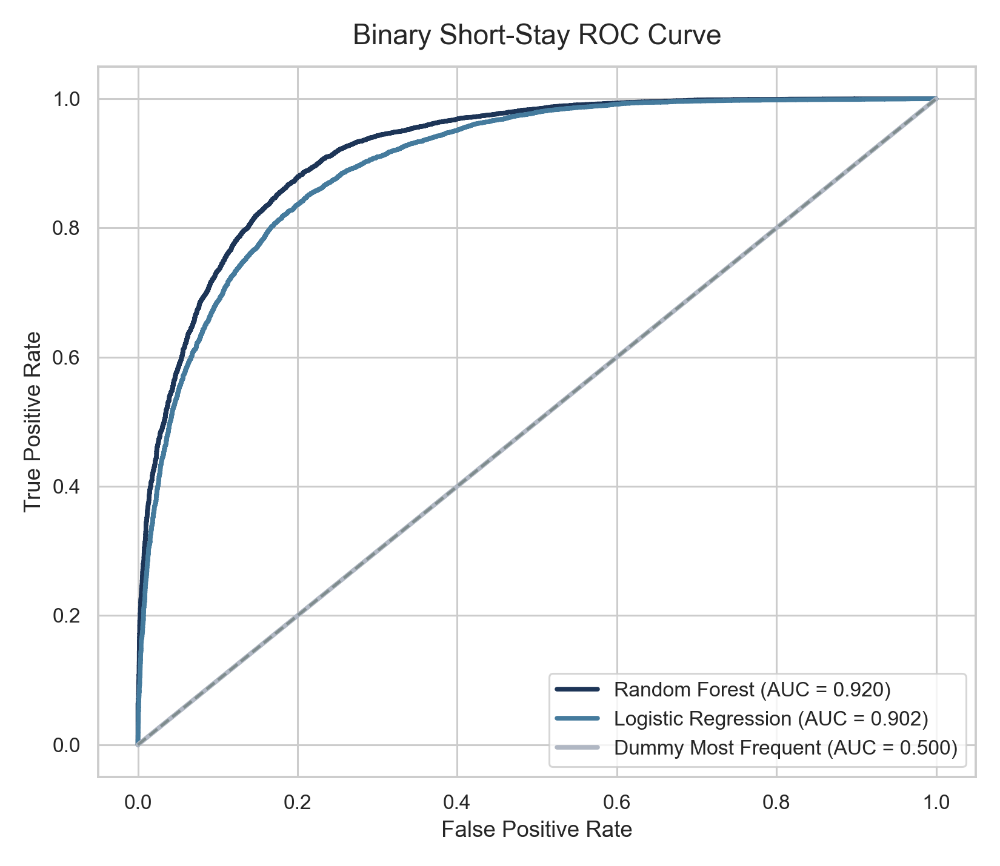
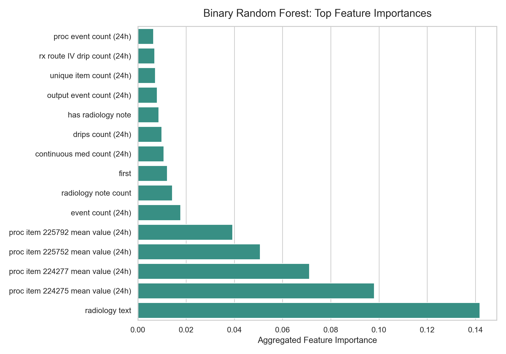

# ICU Length-of-Stay Prediction

Machine learning project for predicting ICU length-of-stay risk from early
clinical signals. The project was developed as a STATS 170B capstone using
MIMIC-IV-derived ICU data, with public-safe demo assets included so the
repository can be reviewed without access to restricted patient records.

## Project Snapshot

- **Goal:** predict whether an ICU stay is short or longer using information
  available early in the admission.
- **Data source:** MIMIC-IV-derived ICU, admissions, chart-event, lab-event,
  radiology, medication, input/output, and procedure tables.
- **Public data policy:** no real patient-level MIMIC-IV records are committed.
- **Public demo:** a saved scikit-learn Random Forest pipeline runs against
  synthetic ICU-style rows.
- **Modeling work:** preprocessing, feature engineering, classification,
  survival modeling, and visualization scripts are included for transparency.

## Run The Public Saved-Model Demo

The fastest way to verify the repository from a fresh clone is:

```bash
python -m venv .venv
source .venv/bin/activate
pip install -r requirements.txt
python saved_models/run_saved_model_demo.py
```

This loads `saved_models/short_stay_random_forest/model.joblib`, validates the
synthetic sample schema, transforms `sample_data/fake_icu_los_sample.csv`, and
prints predicted probabilities for longer-than-2-day ICU stays.

## Repository Structure

```text
saved_models/                 Runnable saved-model inference demo
sample_data/                  Synthetic sample rows for public inference
report_plots/                 Clean figures used in project summaries
reports/                      Written analysis and early findings
models/                       Training and evaluation scripts
preprocessing/                MIMIC-IV feature-building scripts
visualization_scripts/        Code used to generate report figures
project.ipynb                 Capstone notebook export/source
project.html                  Rendered notebook snapshot
```

## Figures

The cleaned project figures are separated in `report_plots/`:







Additional figures include:

- `confusion_matrix_comparison.png`
- `binary_vs_three_way_target_setup.png`
- `los_class_mix_by_icu_unit.png`

## What The Full Pipeline Does

The restricted-data pipeline builds first-24-hour ICU features from multiple
clinical tables:

- baseline demographics and admission features
- vital-sign summaries from chart events
- lab summaries from lab events
- radiology note counts and keyword features
- medication, input/output, and procedure-event summaries
- binary and three-way ICU LOS classification targets
- model comparison and diagnostic plots

The scripts live in `preprocessing/`, `models/`, and
`visualization_scripts/`. They expect local restricted MIMIC-IV-derived files
under `data/raw/` and generated files under `data/processed/`, both of which
are intentionally excluded from GitHub.

## Why The Public Demo Uses Synthetic Data

MIMIC-IV access is restricted and patient-level rows cannot be redistributed
publicly. To keep the repository reviewable, this project includes:

- a small synthetic CSV that follows the model feature shape
- a compact saved scikit-learn pipeline
- metadata describing the model interface
- a runnable inference script

The public demo is meant to verify engineering structure and saved-model
inference. It is not a substitute for the offline clinical evaluation performed
on the restricted dataset.

## Project Highlights

- **Clinically realistic prediction window:** features are restricted to the
  first 24 hours of ICU information, matching an early decision-support use
  case.
- **Leakage-aware evaluation:** offline experiments use grouped train/test
  splitting by `subject_id` to reduce patient leakage.
- **Mixed data modalities:** the feature pipeline combines demographics,
  admission context, charted vitals, labs, medications, fluid input/output,
  procedure events, and first-day radiology-note signals.
- **Reproducible public smoke test:** the GitHub version is intentionally small
  and runnable without access to MIMIC-IV.

## Main Tools

- Python
- pandas, NumPy
- scikit-learn
- DuckDB
- matplotlib
- joblib

## Notes For Reviewers

Start with `saved_models/run_saved_model_demo.py` for the reproducible public
path, then review `models/run_binary_short_stay_classification.py` and the
preprocessing scripts for the full training workflow. The final figures in
`report_plots/` are separated from the plotting code in `visualization_scripts/`
so the analysis is easy to scan.
